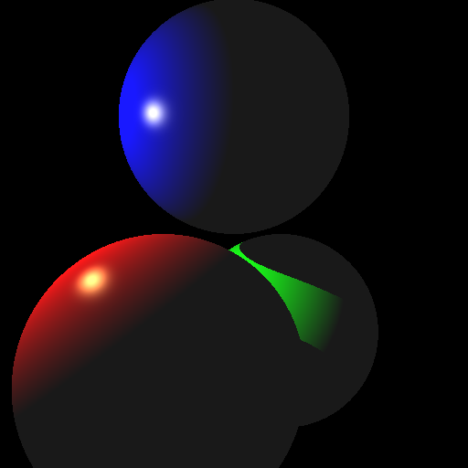
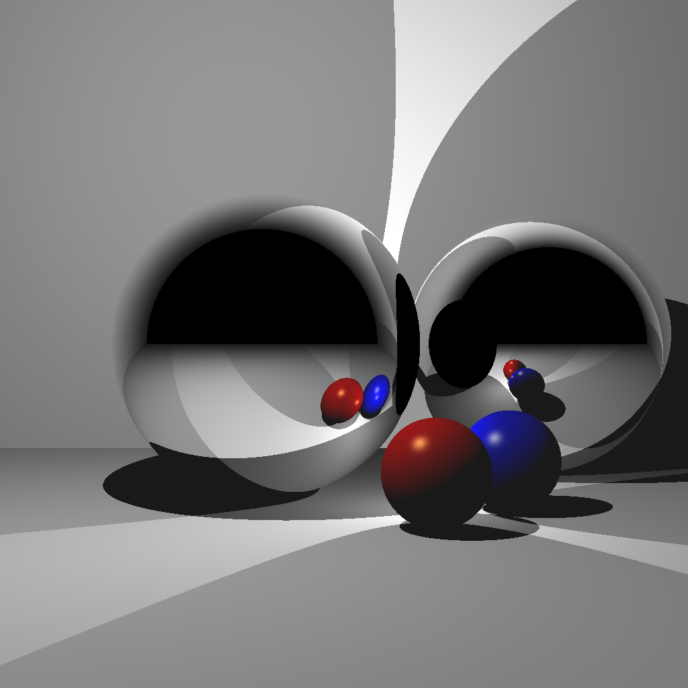

# C++ Raytracer

**Texas A&M University**

* Yi-Cheng Hsiao
  * [LinkedIn](https://yicheng.tw/), [personal website](https://www.linkedin.com/in/yi-cheng-hsiao/)
* Tested on: Apple M1 Pro
  
### Framework
* #### Four all features:
  ##### Basic features
  *    **Sphere**  - [ ] process the image pixels in parallel.  
  *    **Box** - [ ] process the image pixels in parallel.  
  *    **Cylinders** - [ ] process the image pixels in parallel.  
  *    **Multithreading** - [ ] process the image pixels in parallel.  
  *    **Multithreading** - [ ] process the image pixels in parallel.  
  *    **Multithreading** - [ ] process the image pixels in parallel.  
  *    **Multithreading** - [ ] process the image pixels in parallel.  
  *    **Multithreading** - [ ] process the image pixels in parallel.  
  *    **Multithreading** - [ ] process the image pixels in parallel.  
  ##### Advanced features
  *    **Multithreading** - process the image pixels in parallel.  
  *    **Antialiasing** -  by generating multiple primary rays per pixel and averaging.
  *    **Add Box** 
  *    **Motion blur** - have a moving object, and average the result of multiple renders.
  ##### Basic features
  *    **Scene 1: without shadows**
[15] Scene 2: with shadows
[15] Scene 3: with multiple lights
[15] Scene 4: with a single reflection
[15] Scene 5: with multiple reflections
[10] Scene 6: without transform
[10] Scene 7: with transform
[10] Scene 8: transformed camera
[+20] Bonus up to 20 points
[+50] Hardware Acceleration

[+3] Infinite cylinders – you may use online code as long as you cite it in the README.
[+3] Boxes – you may use online code as long as you cite it in the README.
[+3] Include an object or region that will attenuate light (reduce certain color of light based on distance traveled through that region – e.g., think colored glass, or fog).
[+5] Multithreading – process the image pixels in parallel.
[+5] Motion blur – have a moving object, and average the result of multiple renders.
[+5] Blend reflection with Blinn-Phong lighting – e.g., 30% reflection and 70% Blinn-Phong.
[+5] Find code online to accelerate the ray-triangle intersection. You can use a KD-tree, BSP-tree, etc. Remember to cite the source in the code and in the README.
[+5] Constructive solid geometry – intersection, union, and difference.
[+5] Perform antialiasing by generating multiple primary rays per pixel and averaging.
[+5] Create “area” light sources that consist of multiple nearby points.
[+5] Generate multiple reflection rays that spread out around the “exact” reflection to simulate surface roughness. The reflection calculation for the point is the average of these reflection rays.
[+5] Include a texture-mapped object.
[+8] Refraction
[+10] Ambient occlusion
[+20] Monte Carlo path tracing

###
### Example Render

