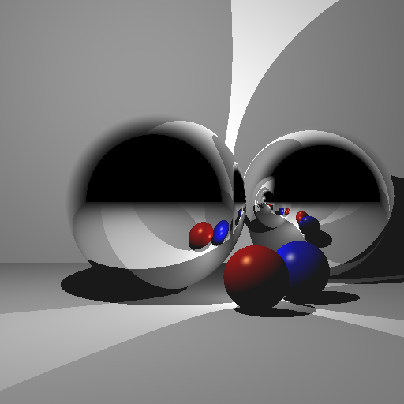

# C++ Raytracer

**Texas A&M University**

* Yi-Cheng Hsiao
  * [LinkedIn](https://www.linkedin.com/in/yi-cheng-hsiao/), [personal website](https://yicheng.tw/)
* Tested on: Apple M1 Pro
  
### Framework
* #### Four all features:
  ##### Basic features
  *    - [x] **Sphere**  - process the image pixels in parallel.  
  *    - [x] **Box** - process the image pixels in parallel.  
  *    - [ ] **Cylinders** - process the image pixels in parallel.  
  *    - [X] **with shadows** - process the image pixels in parallel.  
  *    - [X] **with multiple lights** - process the image pixels in parallel.  
  *    - [X] **with a single reflection** - process the image pixels in parallel.  
  *    - [X] **with multiple reflections** - process the image pixels in parallel.  
  *    - [X] **without transform** - process the image pixels in parallel.  
  *    - [X] **with transform** - process the image pixels in parallel.  
  *    - [X] **transformed camera** - process the image pixels in parallel.  
  *    - [X] **with transform** - process the image pixels in parallel.  
  ##### Material features
  *    - [X] **Reflective** - process the image pixels in parallel.  
  *    - [ ] **Refraction** -  by generating multiple primary rays per pixel and averaging.
  *    - [ ] **Include a texture-mapped object** -
  *    - [X] **Motion blur** - have a moving object, and average the result of multiple renders.
  ##### Basic features
  *    - [ ] **Sphere**  - process the image pixels in parallel.  
  *    - [ ] **Infinite cylinders** – you may use online code as long as you cite it in the README.
  *    - [ ] **Sphere** - Boxes – you may use online code as long as you cite it in the README.
  *    - [ ] **Include an object or region that will attenuate light** - (reduce certain color of light based on distance traveled through that region – e.g., think colored glass, or fog).
  *    - [X] **Multithreading** – process the image pixels in parallel.
  *    - [ ] **Motion blur** – have a moving object, and average the result of multiple renders.
  *    - [ ] **Blend reflection with Blinn-Phong lighting** – e.g., 30% reflection and 70% Blinn-Phong.
  *    - [ ] **Find code online to accelerate the ray-triangle intersection.** - You can use a KD-tree, BSP-tree, etc. Remember to cite the source in the code and in the README.
  *    - [ ] **Constructive solid geometry** – intersection, union, and difference.
  *    - [ ] **Perform antialiasing** - by generating multiple primary rays per pixel and averaging
  *    - [ ] **Create “area” light** - sources that consist of multiple nearby points.
  *    - [ ] **Generate multiple reflection rays** - that spread out around the “exact” reflection to simulate surface roughness. The reflection calculation for the point is the average of these reflection rays.
  *    - [ ] **Include a texture-mapped object**
  *    - [ ] **Ambient occlusion**
  *    - [ ] **Monte Carlo path tracing**

###
### Example Render

